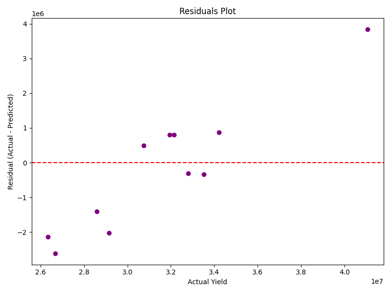
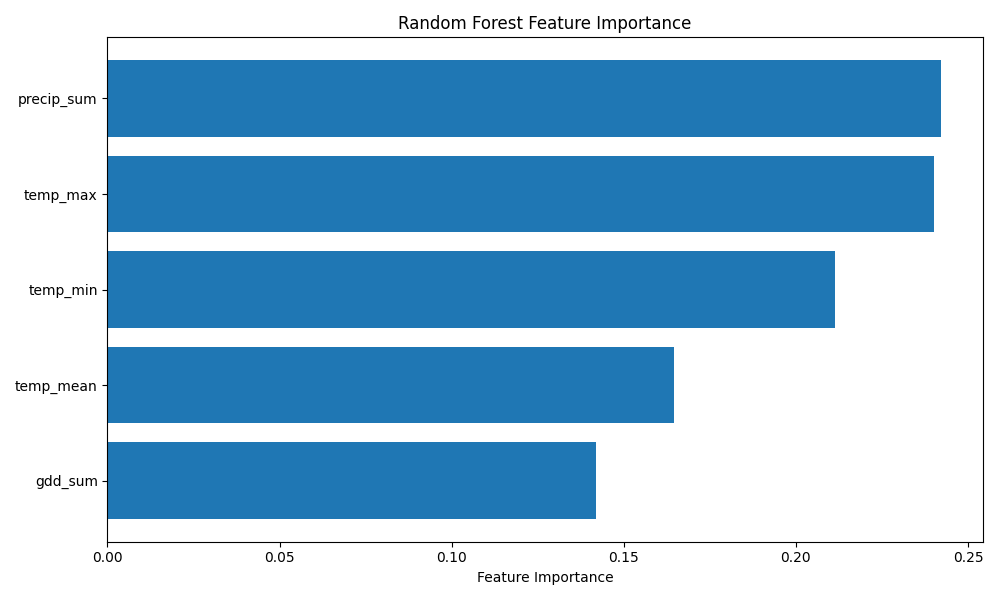
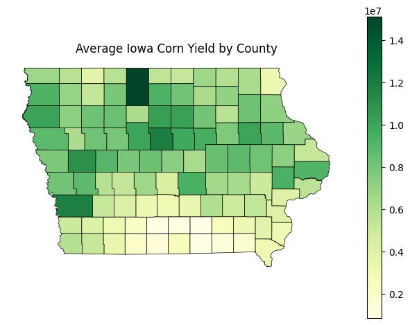

# Climate-Driven Corn Yield Prediction Model for Iowa Counties
This project develops a machine learning model to predict corn yields across Iowa's 99 counties using 11 years of historical USDA yield data and climate data (2013-2023), including Growing Degree Days, Precipitation, and Temperature metrics. The model achieved an R² score of 0.80, with feature importance analysis revealing key climate drivers.

# Climate-Driven Corn Yield Prediction Model for Iowa Counties

[](https://www.python.org/downloads/release/python-380/)
[](https://scikit-learn.org/)
[](https://opensource.org/licenses/MIT)

A machine learning model that predicts corn yields across Iowa's 99 counties using climate variables, achieving an **R² score of 0.80** on the full dataset. This project demonstrates the application of data science to agricultural sustainability and climate impact assessment.

## Project Overview

This project builds a **Random Forest regression model** to predict corn yields based on:
- **Growing Degree Days (GDD)**: Heat accumulation during growing season
- **Precipitation patterns**: Total during April-September  
- **Temperature metrics**: Mean, max, and min temperatures

**Key Results:**
- **R² score of 0.80**, indicating a good fit to the data.
- Feature importances highlight the key climate drivers influencing corn yield:
    - Precipitation Sum: 0.2421
    - Temperature Max: 0.2400
    - Temperature Min: 0.2113
    - Temperature Mean: 0.1645
    - Growing Degree Days: 0.1420

This R² score of 0.80 indicates that the model explains 80% of the variance in Iowa corn yields based on the included climate features. The feature importances reveal that precipitation and temperature extremes (max and min) were the most influential factors in the model's predictions, followed by the mean temperature and growing degree days. This suggests that while heat accumulation (GDD) is important, the amount of rainfall and the range of temperatures experienced during the growing season play a more significant role in determining yield outcomes in this dataset.

## Quick Start

### Installation
```bash
git clone https://github.com/yourusername/iowa-corn-yield-ml-predictor.git
cd iowa-corn-yield-ml-predictor
pip install -r requirements.txt
```

### Run the Analysis
Run the individual scripts in order:
```bash
python src/data_collection.py
python src/feature_engineering.py
python src/modeling.py
python src/visualization.py
```
Or view the results dashboard:
```bash
# Open the index.html file in your web browser
```

## Project Structure

```
iowa-corn-yield-ml-predictor/
├── README.md
├── requirements.txt
├── src/
│   ├── data_collection.py            # Data generation utilities
│   ├── feature_engineering.py        # Agricultural feature creation
│   ├── modeling.py                   # ML model training
│   └── visualization.py              # Plotting functions
├── results/                          # Visualizations and metrics
│   ├── actual_vs_predicted.png
│   ├── residuals.png
│   ├── feature_importance.png
│   ├── iowa_yield_map.png
│   └── average_yield_map.png
├── models/                           # Trained model files
│   └── trained_rf_model.pkl
└── data/
    ├── raw/          # Raw data files
    └── processed/    # Processed features
```

## Methodology

### Data Sources
- **Yield Data**: USDA NASS county-level corn yields (2013-2023)
- **Climate Data**: Iowa Environmental Mesonet (IEM) station data (2013-2023)
- **Geographic Data**: US Census Bureau county boundaries (2020 GeoJSON)

### Feature Engineering
Climate features calculated for the growing season (April-September):
```python
- Growing Degree Days (GDD)
- Total Precipitation
- Mean Temperature
- Maximum Temperature
- Minimum Temperature
```

### Model Architecture
**Random Forest Regressor** trained on aggregated yearly data (2013-2023).

## Results

### Model Performance
- **MAE:** 1,420,932.26
- **R² Score:** 0.80

### Feature Importances
The model identified the following feature importances:
1. Precipitation Sum: 0.2421
2. Temperature Max: 0.2400
3. Temperature Min: 0.2113
4. Temperature Mean: 0.1645
5. Growing Degree Days: 0.1420

### Visualizations
The project generates several visualizations saved in the `results/` directory:

1. **Actual vs Predicted Yield**
   

2. **Residuals Plot**
   

3. **Feature Importance**
   

4. **Average Yield Map (2013-2023)**
   

## Data Download Instructions

### USDA Data
1. Visit [USDA Quick Stats](https://quickstats.nass.usda.gov/)
2. Register for an API key.
3. Add the API key to a `.env` file in the project root: `USDA_API_KEY=your_api_key_here`

### Climate Data
The climate data is automatically downloaded from IEM when running `src/data_collection.py`.

### County Boundaries
The county boundaries GeoJSON is automatically downloaded from the Census Bureau when running `src/data_collection.py`.

## Future Enhancements

- Incorporate more detailed climate data (e.g., county-level, daily).
- Include additional relevant features (e.g., soil data, planting dates).
- Explore different machine learning models and techniques.
- Develop more interactive visualizations.

## License

This project is licensed under the MIT License - see the [LICENSE](LICENSE) file for details.

## Author

[Oscar Babin]

---